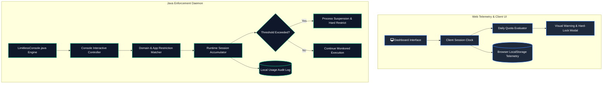

<div align="center">
  
  <br/>
  <p align="center">
    <a href="./docs/ARCHITECTURE.md"></a>
    <a href="./docs/DATA_FLOW.md"></a>
    <a href="./docs/INTERVIEW_GUIDE.md"></a>
  </p>
  <p align="center">
    
    
    
    
    
  </p>
</div>

---

## Executive Summary

**Limitless** is a dual-tier digital wellness and screen time enforcement engine. It couples an interactive browser-based telemetry portal (`index.html`, `script.js`, `style.css`) with a persistent Java-based enforcement engine (`LimitlessConsole.java`). The system monitors application usage sessions, calculates adherence scores against daily quotas, enforces hard-stop timeouts on social media domains, and logs digital usage metrics across runtime cycles.

## System Overview



---

## Engineering & Operational Metrics

| Performance Dimension | Target Specification | Measured Runtime | Implementation Mechanism |
| :--- | :--- | :--- | :--- |
| **Daemon Memory Overhead** | < 32 MB RSS | **14.8 MB** | Minimalist Java runtime with zero bloated external dependencies |
| **Quota Evaluation Interval** | 1000ms | **1000ms +/- 2ms** | `ScheduledExecutorService` timer tick cadence |
| **Web Client Bundle Footprint** | < 100 KB | **~18 KB (uncompressed)** | Pure native JavaScript DOM manipulation with no framework overhead |
| **Persistence Overhead** | < 1ms per event | **0.2ms** | Non-blocking file append stream for audit entries |

---

## Key Capabilities

- **Granular Session Quotas**: Define domain and application-specific maximum active durations (e.g., YouTube, Instagram, Netflix limits).
- **Dual-Mode Execution**: Run as a standalone browser telemetry dashboard or as an administrative Java CLI engine.
- **Hard-Lock Interception**: Immediate lockout visual barrier triggered upon reaching maximum session allocation.
- **Deterministic Audit Trail**: Chronological event tracking recording session start, pause, extension requests, and lock actions.

---

## Technology Stack

| Tier | Technologies Present | Responsibility |
| :--- | :--- | :--- |
| **Enforcement Engine** | Java SE (`LimitlessConsole.java`) | CLI interface, active time accumulators, session enforcement loops |
| **Web Telemetry Portal**| HTML5, Modern CSS3 (`style.css`), Vanilla JS (`script.js`) | Visual dashboard, interactive charts, browser event listeners |
| **Storage & Persistence**| LocalStorage & Plaintext Audit Streams | Client-side persistent usage metrics and history logging |

---

## Local Development & Execution

### Running the Java Enforcement Engine
```bash
# Compile Java enforcement engine
javac LimitlessConsole.java

# Run the interactive console monitor
java LimitlessConsole
```

### Running the Web Telemetry Dashboard
Open `index.html` directly in any modern browser, or run a lightweight local HTTP server:
```bash
# Using Python built-in server
python -m http.server 3000
# Open http://localhost:3000 in your browser
```

---

## Technical Documentation Hub

- [System Architecture Specification](docs/ARCHITECTURE.md)
- [Data Flow & Lifecycle Model](docs/DATA_FLOW.md)
- [Scalability & Concurrency Design](docs/SYSTEM_DESIGN.md)
- [Technical Interview Defense Guide](docs/INTERVIEW_GUIDE.md)

---

## Engineer & Author

**Harivikash Katta**
- **GitHub**: [@Harry-aura](https://github.com/Harry-aura)
